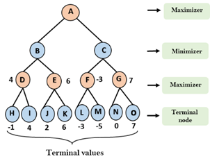

Hardware and Code
=================

Key Goals
---------

Options
-------
.. _hwcodeOptions:

The following table offers some simple
comparisons of the different platforms....

.. .. table:: Comparison

    =============== =============== ======= ===========
    Platform        Self-Contained? Cost    Flexibility
    =============== =============== ======= ===========
    Raspberry Pi    No              $30     Limitless
    Lego Mindstorms Yes             $350    Medium
    =============== =============== ======= ===========

  +-----------------+------------+-------+--------------+
  || Platform       || Self-     || Cost || Flexibility |
  ||                || Contained ||      ||             |
  + =================+============+=======+==============+
  | Raspberry Pi    | No         | $30   | Limitless    |
  +-----------------+------------+-------+--------------+
  | Lego Mindstorms | Yes        | $350  | Medium       |
  +-----------------+------------+-------+--------------+

.. list-table:: Comparison
    :widths: 20 10 10 15
    :header-rows: 1

    * - Platform
      - Self-Contained
      - Cost
      - Flexibility
    * - Raspberry Pi
      - No
      - $30
      - Limitless
    * - Lego Mindstorms
      - Yes
      - $350
      - Medium

..   .. csv-table:: Comparison
        :header: Platform, Self-Contained?, Cost, Flexibility
        :widths: 15 10 30 30

        Raspberry Pi, No, $30, Limitless
        Lego Mindstorms, Yes, $350, Medium

Raspberry Pi (Family)
~~~~~~~~~~~~~~~~~~~~~
Here's what a Raspberry Pi 2 and
a Sense Hat look like:

.. image:: /images/PiWithSenseHat.jpeg

With these you can do cool things
like program your own version
of Connect-4 -- you will need to
consider how to check for a 
win by evaluating options as shown
in the diagram below:

Lego Mindstorms
~~~~~~~~~~~~~~~
